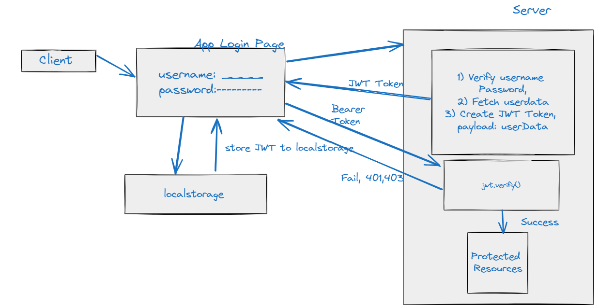

https://www.youtube.com/watch?v=LmtRXFCwp7M&list=PLm1F_IPT_MzxzOau3mWJnPS-v1sbNTPxm&index=3

How does client recognise the token expired and send refresh token?
Typically, clients do not check if a token is expired. Instead, they make an API request using the current access token. If it fails due to the token being expired, they handle this case specifically.

When the server checks the incoming access token and finds that it's expired, it responds with a 401 (Unauthorized) HTTP status code. In other cases, a 403 (Forbidden) status code might be used.

The client, on receiving a 401 or 403 status code, realizes that the access token has expired. The client then uses the refresh token to ask the server for a new access token. If the refresh token is valid, the server issues a new access token.

In terms of how this can be set up, it depends on the specific implementation of your client-side logic.

Here is a simple example of how this might work:

javascript

async function requestWithToken(url, accessToken, refreshToken) {
  try {
    const response = await fetch(url, {
      headers: {
        'Authorization': 'Bearer ' + accessToken
      }
    });

    if (response.status === 401) {
      // Try to refresh the token
      const newToken = await refreshToken();

      // Retry fetching with new token
      return await fetch(url, {
        headers: {
          'Authorization': 'Bearer ' + newToken
        }
      });
      
    }
    
    return response;

  } catch (err) {
    // handle errors
  }
}

// refresh token function
async function refreshToken(refreshToken) {
  const response = await fetch('/token', {
    method: 'POST',
    body: JSON.stringify({ refreshToken })
  });

  if (response.ok) {
    const data = await response.json();
    return data.accessToken;
  }

  throw new Error('Could not refresh token');
}
In real world applications, you may use HTTP clients like Axios in which you can easily set up an interceptor for handling token refresh logic globally.

Full responsibility for code correctness, security and licensing lies solely with the user, not with DIAL platform or LLM vendor.

Regenerate response

