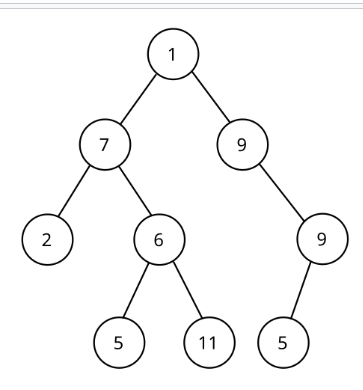

Tail Recursion(same as iteration, best) Vs Head Recursion
---------------------------------
**Head Recursion** and **Tail Recursion** are two types of recursion, differentiated by the order in which operations are performed in relation to the recursive call. In JavaScript (like in other programming languages), understanding how these two recursion types function helps you write performant and readable recursive code.

---

### **Head Recursion**
A recursive function is called "*head recursion*" if the recursive call happens **before** performing any other operation. Essentially, the function defers operations **until the recursive calls are complete**.

#### Characteristics of Head Recursion:
- The recursive call is made first.
- Work is done after the recursive call completes, during the "unwinding" phase of the recursion stack.
- Memory overhead is higher because each recursive call must be held in the stack until recursion completes.

#### JavaScript Example

```javascript
function headRecursion(n) {
    if (n === 0) return; // base case
    headRecursion(n - 1); // recursive call
    console.log(n); // operation after recursive call
}

headRecursion(5);
// Output: 1 2 3 4 5
```

**Explanation:**
- The recursive call goes all the way to `headRecursion(0)` (base case).
- As it "returns" from each recursive call, the `console.log(n)` operation is performed, printing the numbers in ascending order.

---

### **Tail Recursion**
A recursive function is called "*tail recursion*" if the recursive call happens **last**, meaning there are **no operations after the recursive call** within the function. This kind of recursion can be optimized into **iteration** by the compiler (known as tail-call optimization), which reduces the memory overhead of recursion.

#### Characteristics of Tail Recursion:
- The recursive call is the last operation in the function.
- Allows tail-call optimization (if supported by the runtime).
- Memory-efficient since intermediate stack frames can be reused or optimized away.

#### JavaScript Example

```javascript
function tailRecursion(n, accumulator = 0) {
    if (n === 0) return accumulator; // base case
    return tailRecursion(n - 1, accumulator + n); // tail recursive call
}

console.log(tailRecursion(5)); // Output: 15 (sum of 1+2+3+4+5)
```

**Explanation:**
- The recursive call to `tailRecursion` is the **last operation**, and it passes the intermediate result (`accumulator`) down the recursion chain.
- In the base case (`n === 0`), the final result (`15` here) is returned directly, avoiding the need to "unwind" the stack.

---

### **Head Recursion vs Tail Recursion**

| **Aspect**              | **Head Recursion**                          | **Tail Recursion**                           |
|-------------------------|--------------------------------------------|---------------------------------------------|
| **Order of Operations**  | Operation happens **after** recursive call. | Operation happens **before** recursive call. |
| **Memory Usage**         | Higher (stack frames build up).            | Lower (eligible for tail-call optimization). |
| **Efficiency**           | Less efficient (requires stack unwinding). | More efficient (can be optimized into iteration). |
| **Example Use Cases**    | Tree traversal (e.g., in-order traversal).  | Summation, factorial, or iterative problems. |

---

### **Advantages of Each**

#### Advantages of Head Recursion:
1. Easier to conceptualize for problems like **in-order traversal** in binary trees, where you perform actions after completing recursive calls.
2. Useful for tasks where you need to wait for the recursive "work" to finish before doing your operation.

#### Advantages of Tail Recursion:
1. Memory-efficient because it doesn't require storing the call stack for intermediate results.
2. Allows problems to be solved systematically through iteration-like mechanisms when runtime supports **tail-call optimization**.
3. Suitable for tasks like summation, factorial, and similar problems.

---

### Example Problems

#### 1. Factorial using Head Recursion

```javascript
function factorialHead(n) {
    if (n === 0) return 1; // base case
    const result = factorialHead(n - 1); // recursive call
    return n * result; // operation after recursive call
}

console.log(factorialHead(5)); // Output: 120
```

#### 2. Factorial using Tail Recursion

```javascript
function factorialTail(n, accumulator = 1) {
    if (n === 0) return accumulator; // base case
    return factorialTail(n - 1, accumulator * n); // tail recursive call
}

console.log(factorialTail(5)); // Output: 120
```

---

### Example Problem: Fibonacci Sequence

#### Using Head Recursion
```javascript
function fibonacciHead(n) {
    if (n <= 1) return n; // base case
    return fibonacciHead(n - 1) + fibonacciHead(n - 2); // work after call
}

console.log(fibonacciHead(6)); // Output: 8
```

#### Using Tail Recursion
Tail recursion is harder for Fibonacci because it requires accumulating intermediate results, but you can implement it with helper parameters:

```javascript
function fibonacciTail(n, a = 0, b = 1) {
    if (n === 0) return a; // base case
    if (n === 1) return b; // base case
    return fibonacciTail(n - 1, b, a + b); // tail recursive call
}

console.log(fibonacciTail(6)); // Output: 8
```

---

### **Summary**
- **Head Recursion** is used when operations depend on results from deeper recursive calls. However, it carries more memory overhead due to the stack requiring "unwinding."
- **Tail Recursion** is used for optimization and efficiency. It’s more performant because it can be converted into a loop-like iteration (if supported by the runtime).

For problems where **order of execution matters after the recursion** (like tree traversals), use head recursion. For problems where the result is passed progressively through recursive calls (like factorial, summation), use tail recursion.