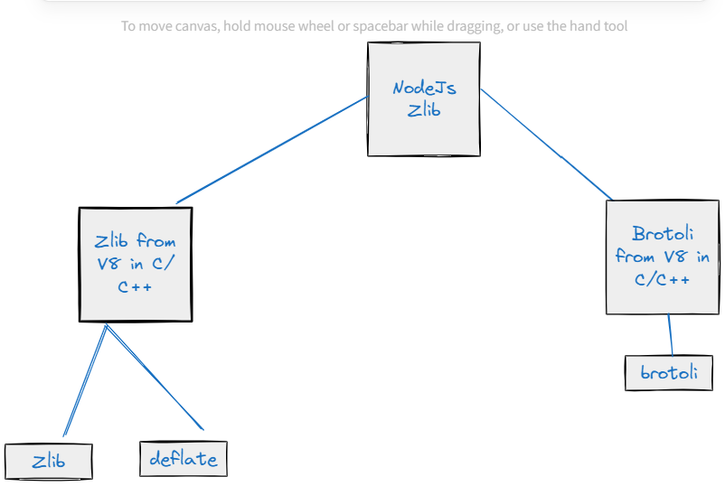

What is Compression?
Compression is the process of reducing the size of a file or data set by removing redundancies or using algorithms that encode the information using fewer bits.

Types of Compression?
Lossy Compression : some data is discarded to achieve higher compression ratios. eg Images, Videos, Audio files. Jpeg, Mp3
Lossless Compression : where the original data can be perfectly reconstructed
eg: Data Storage, data transmission eg: PNG, ZIP,FLAC

How do we do compression in Node? 
**LOSSLESS**
All these are LOSSLESS Compression Techniques:
using Gzip, Brotli, and Deflate
Gzip is built on top of Deflate 
Audio/Video: PNG, FLAC etc etc 

Gzip Eg:
const gzip = require(node:gzip)
gzip.createGzip() // To compress
gzip.createGunZip() // To uncompress the compressed file

Brotli example:
const brotli = require(node:brotli)
brotli.createBrotliCompress() // To compress
brotli.createBrotliUnCompress() // To uncompress the compressed file

Deflate example:
const deflate = require(node:deflate)
deflate.createDeflate()
deflate.createInflate()

Alogithims used in Gzip, Brotli, and Deflate  are 
See the video  for brief explaination of these Algorithms 
1) Huffman Coding 
2) LZ: this family of algos, "LZ77" is special

NodeJS Hierarchy of Zlib
------------------------

----------------------------------------------

**LOSSY**
Once you do Lossy compression, the changes are irreversible, you cannot get back the original image/audio/video
, Bit of quality is lost 
Don't compress twice, there will not be much difference w.r.t LOSSY compression
In Node we cannot do LOSSY compression, we need to use external tools
1) JPEG [its a format and also a compression technique]
2) MP3 [its a format and also a compression technique]
3) AAC 
4) H264

Compression in Http:
====================
Client-Side: Browser automaticalyy adds these headers
--------
Accept-Encoding: gzip,deflate,br  (brotli)
--> decompress the compressed data is done automatically by modern-day browsers.

Server-Side:
headers:
--------
Content-Length: this should be the length of compressed data and NOT the original.
Content-Encoding: Will say the client , using which tool/technique the compression has been done 

--> Its ideal to do all the compression at Proxy Level(Nginx-Proxy etc), without touching the NodeJs Source code at all.

Minification Vs Compression 
----------------------------
Minification:

Minification is the process of removing unnecessary or redundant data without affecting how the resource is processed by the browser. This includes removing white spaces, newline characters, comments, and block delimiters which are useful for readability but not required for execution.
It simplifies the code without changing its functionality; for example, shortening variable names to one character.
Commonly used in text-based files such as HTML, CSS, and JavaScript files.
Compression:

Compression involves encoding information using fewer bits than the original representation. Unlike minification, which primarily works by removing superfluous text in files, compression uses algorithms to find patterns and replace them with more efficient representations.
It is a broader technique applicable to a wider variety of data types, including images, videos, and binary files.
Techniques can be lossless (where original data can be perfectly reconstructed) or lossy (where some data is lost).
Key Differences:

Minification is about removing unnecessary characters and rewriting code to take up less space without changing the functionality, while compression typically involves algorithms for encoding data differently to reduce size.
Minification can be thought of as a subset of compression techniques specifically focused on text-based formats without altering their meaning, while compression encompasses a broader set of techniques for various data types.