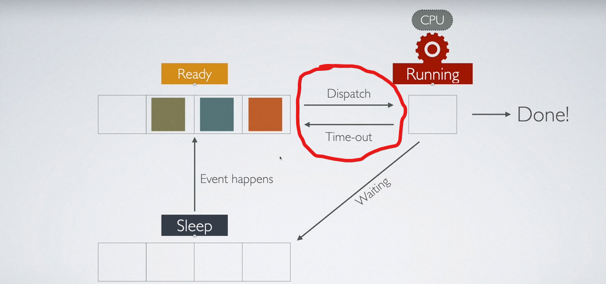
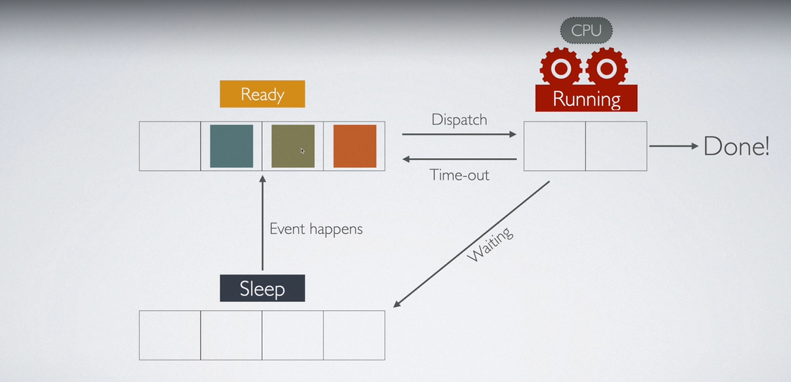

Udemy: https://www.udemy.com/course/understanding-nodejs-core-concepts/learn/lecture/44958729#announcements

Useful Links
https://medium.com/modern-mainframe/multithreading-in-java-vs-node-js-c558d59050c9
Cluster Vs WorkerThreads: https://medium.com/@erickzanetti/optimizing-node-js-application-performance-with-cluster-and-worker-threads-59258400ca6f#:~:text=Unlike%20the%20Cluster%20API%2C%20which,each%20other%20via%20shared%20memory. 

Cluster:
The cluster module is specifically designed for creating multiple Node.js processes for load balancing across multiple CPU cores. Cluster allows you to create multiple independent Node.js processes (called worker processes), each running an instance of your application.

Worker Threads:
The worker_threads module allows you to run multiple threads within a single Node.js process. These threads share the same memory space, but each has its own separate execution context, enabling more fine-grained, multi-threaded programming (e.g., for CPU-intensive tasks).


 ## CPU SCHEDULING ## 

--> The highlighted section in the image is called as context switching
--> process or thread is the samething in linux, in other OS a process contains minimum of one thread.
--> The process is scheduled to Ready Queue, from there the CPU Processor(one of the core if its multi core) picks up the process execute the instructions in the processes,this task is done by dispatch and once all instructions are done or waiting for further instructions the process is moved to sleep queue.
--> Each process in ready queue is executed for limited time, in that time if the instructions are executed the process is moved to sleep queue or, if instructions are still pending and the time out occurs, the process is moved again to ready queue.
--> thus CPU processor gets to process multiple processes , from the user perspective all the processes are been run simultaneously but under the hood the process are run one at a time by the CPU scheduler. This is also called as CONCURRENCY.
--> If there are multi cores, the same process repeats in multi core, multiple processes will be moved to multi cores and the concept remains same.

 ## Concurrency Vs Parallel ## 

If there are multiple cores on CPU, In this image of multicore, two procesess can run PARALLELY , but all three processes run concurrently , two tasks can start of on two cores at same time hence parallel, where as 3 processess are switching between the two cores to give a feel that all are running parallely but its running concurrently

 ## What is a Thread? ## 
--> Thread is a unit of execution, a process contains a thread minimum of 1
--> Assume there is a Process P1,P2,P3 each one with one thread T1,T2,T3.
--> These processes are been scheduled ,as explained in  ## CPU SCHEDULING ## 
--> Now we can create a thread(in node or C# etc) T1.2,  inside of P1 .
--> Each of these Threads of are exactly treated like processes by CPU scheduler
--> so in Ready Queeue now we can have T1,P2,P3,T1.2 which are been scheduled and works same as explained in  ## CPU SCHEDULING ## 
--> So thats how these threads work.
--> We can also directly create Processes( node--> childProcess), 
 ### what advantage do we have creating threads ###
        --> creation of threads is very fast , when compared to process.
        --> sharing memory with threads is easier, process acts like a container and shares memory to threads, so we need not interact with OS
        --> if we have to share memory between processes, we need to use share memory offered by OS.

 ### Main Thread Vs Worker Thread(custom thread) ###
process.exit(0) this will not exit the entire process, it will only exit the thread where its been used. So when you use in worker_thread only worker_thread will be exited , the main thread will still keep running
--> console.log in worker thread is sent to main_thread and there it will log to the terminal stdin, stdout stderr of main_thread is only used across the multiple threads . If main_thread is blocked, the logs from worker_threads are not logged

 ## How threads communicate with each other ## 
 --> Message Channels 
[Threads Communication](https://www.udemy.com/course/understanding-nodejs-core-concepts/learn/lecture/44958739#overview)
--> [Learn about structured clone and transferable_objects](https://developer.mozilla.org/en-US/docs/Web/API/Web_Workers_API/Structured_clone_algorithm)
structured clone is a mechanism used in the worker_threads module to deep copy complex JavaScript objects between threads (e.g., between the main thread and worker threads). This ensures the object maintains its structure and semantics (handling things like objects, arrays, Map, Set, ArrayBuffer, etc.).

When you use worker.postMessage(data) to send data to a worker (or receive a message), the structured clone algorithm is automatically applied to serialize and deserialize the data.  ## *This is more powerful than JSON because it supports more data types (e.g., Map, Set, Date) and handles circular references when appropriate. ## *
```
//Main.js
const { Worker } = require('worker_threads');

// Data to be sent to the worker
const data = { name: 'John', age: 30, hobbies: ['coding', 'reading'] };

// Create a worker thread and send the data
const worker = new Worker('./worker.js');
worker.postMessage(data);

worker.on('message', (message) => {
  console.log('Received from worker:', message); // Deep-cloned response
});

//worker.js
const { parentPort } = require('worker_threads');

// Listen for incoming messages
parentPort.on('message', (data) => {
  console.log('Received in worker:', data);

  // Modify the received data
  data.age += 1;

  // Send the modified data back to the parent thread
  parentPort.postMessage(data);
});
```
### Message Channel ###
```
const {MessageChannel, workerData, Worker} = require('worker_threads');
const channel = new MessageChannel()
const {port1, port2} = channel;
```

These port1, port2 are used to communicate between different worker threads and also with main thread.
**NOTE**: There are only two ports available .
```
port1.postMessage('some message');
port2.on('message', (msg)=>{
 console.log(msg)
})
```

**transferList** 
When the port1 and port2 are sent to other worker threads , it makes no sense to access them inside the main thread again , 
hence these should be included inside transferList array , 

### Shortcut to MessageChannel ###
```
const thread1 = new Worker('./calc.js');
//Below LOC of code will simply use the MessgeChannel and send the data , shorthand way.
thread1.on('message', (msg) =>  console.log(`${msg}`))
thread1.postMessage({name:'Ajay Nallanagula'})

//inside calc.js, how do we send data to main thread?
const {MessageChannel, workerData, Worker, parentPort} = require('worker_threads');
parentPort.on('message',(msg)=> {})
parentPort.postMessage({})
```

**NOTE**: 
1) Data sharing among threads is done by cloning, each time you are sharing the data 
 the data is cloned(a new copy is created), Its not a mutation.
2) Is there a way to share common data among the treads, yes there is its "Shared Memory" concept.

In Nodejs we have perf_hooks to check the performance of Node application code
const { performance } = require('perf_hooks');

Scenario for using Threads: 
--> Mathermatical Operations like Prime Number Generation., sorting,
--> Image Processing
--> Audio Processing
--> Encryption of text & Decryption of text
--> Reading a Large file 
--> 

**Worker Pool**: its there to limit the creation of threads ,
rather than we creating the threads and exiting from there , this task will be taken care by worker pool

**isMainThread** : true if its main thread false if its worker-thread

**NOTE**:
***WorkerThreads are efficent in handling CPU-Intensive Operations***
In , the task that takes processing inside CPU is CPU-Intensive operation like 
--> Mathermatical Operations like Prime Number Generation., sorting,
--> Image Processing
--> Audio Processing
--> Encryption of text & Decryption of text
--> Compression

***Node itself is efficent, great in handling I/O Intensive Operations.***
In , some thing that doesn't take help of CPU, but relies on external sources like Networking, filesystem tasks etc and moves to Sleep State in diagram, they are called as I/O Operations


***Memory Intensive Operations***


**To avoid bottle-necks in worker threads , we tend to use Batching**
 Watch this video: 180. Examining a Crypto-Heavy Multi-Threaded App

 **Threadpool**
In node you don't directly interact with threadpool, we trigger functions to consume ,its already existing in c/c++(Libuv)
Threadpool by default have 4 threads
Async/Promises trigger threadpool
UV_THREAD_POOL_SIZE is the env.variable to change the default of threadpool from 4 threads , used as command line arg.
```
const { performance } = require('perf_hooks');
performance.eventLoopUtilization()
```
### To use the memory and CPU utilization efficently in multi-thread context we need to think of BATCHING.


### In nodejs, mutli threaded program, How can I findout if the task is executing on main thread and on worker threads
In Node.js, you can use the worker_threads module to determine whether a task is being executed on the main 
thread or a worker thread. The worker_threads module provides access to a property called isMainThread, 
which is a boolean indicating whether the current thread is the main thread (true) or a worker thread (false).
Here is how you can find out if a task is running on the main thread or a worker thread:
```
const { isMainThread, Worker } = require('worker_threads');

// Check if the code is running on the main thread
if (isMainThread) {
    console.log("This is the main thread.");

    // Create a worker thread
    const worker = new Worker(__filename);
    worker.on('message', (message) => {
        console.log(`Message from worker: ${message}`);
    });
} else {
    console.log("This is a worker thread.");
    
    // Simulate executing some task
    console.log("Worker is performing a task...");

    // Optionally, send a message back to the main thread
    process.exit(0);
}
```
## Handling 100's of HTTP Requests

## Shared Memory
In browser we can use only TypedArray, we cannot used SharedArrayBuffer and ArrayBuffer
SharedArrayBuffer and ArrayBuffer deal only with binary data, very low level
The heirarchy is as 
Buffer---{derieved from}-->TypedArray--{derieved from}-->SharedArrayBuffer and ArrayBuffer

# Atomic Operations 
https://developer.mozilla.org/en-US/docs/Web/JavaScript/Reference/Global_Objects/Atomics 

Thread When to use Atomic.add Vs Mutual-Exclusion Vs Semaphore Vs Mutex.

Mutual exclusion , 
Way 1 `SPINLOCK`: Where you use a lock value to block your critical section logic. 
       Rather than using a random variable value , which can cause the threads to execute at same time
       We can use `Atomic.compareExchange()`

       When we use Atomic.compareExchange(), your all threads that are involved will be blocked, because of the lock created.
       To avoid that situation we  use Atomics.wait() and Atomics.notify().


## Deadlocks ##

