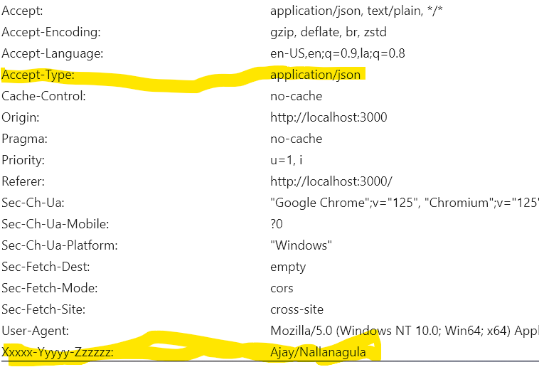

axios reference: https://www.youtube.com/watch?v=mS48F0swwAY&list=PLnHJACx3NwAdSOK3BoQ7wjCDT1Iw7hs_u

Axios Docs: https://axios-http.com/docs/cancellation 

What is Axios?
Axios is a promise-based HTTP Client for node.js and the browser. It is isomorphic (= it can run in the browser and nodejs with the same codebase). On the server-side it uses the native node.js http module, while on the client (browser) it uses XMLHttpRequests.

Features of Axios
Make XMLHttpRequests from the browser
Make http requests from node.js
Supports the Promise API
Intercept request and response
Transform request and response data
Query parameters serialization with support for nested entries
Automatic request body serialization to:
    JSON (application/json)
    Multipart / FormData (multipart/form-data)
    URL encoded form (application/x-www-form-urlencoded)
Posting HTML forms as JSON
Automatic JSON data handling in response

What are Global defaults ?
You can specify config defaults that will be applied to every request.
Example : 
axios.defaults.baseURL = 'https://api.example.com';
axios.defaults.headers.common['Authorization'] = AUTH_TOKEN;
axios.defaults.headers.post['Content-Type'] = 'application/x-www-form-urlencoded';

How to Get Global Instance values applicable for all the axios requests ?
Step 1: Inside axios-global.js, In this you set all your default headers , that need to go in every request .
import axios from "axios"

axios.defaults.headers.common["Content-type"] = 'application/xml'
axios.defaults.headers.common["Accept-type"] = 'application/json'
axios.defaults.headers.common["XXXXX-YYYYY-ZZZZZZ"] = "Ajay/Nallanagula"

export default axios

Step 2: !IMPORTANT
//Inside Root App.js import axios-global.js file 
import axios from './axiosdemos/axios-global'

Now on when you use axios.get, axios.post, axios.put etc any where you will see that all your headers are passed

What is disadvantage of Global Defaults ?
The headers are default for every request, If you want specific headers for specific requests that cannot be set with global defaults , these can be set only using "Custom Instances"

NOTE: Global defaults are also applicable to Custom Instances 

Custom Instances, specific to requests based on domain, features etc?
 Step 1:
Inside  axios-product-instance.js

import axios from "axios";

const productInstance = axios.create({
    baseURL: 'https://dummyjson.com',
    headers: {
        "AAAA-BBBB-CCCC": "Product/WASHINGMACINE, Product/VACCUMCLEANER"
    }
})

export default productInstance

//Inside Service/Utility  
import productInstance from './axios-product-instance'

export const axiosCustomInstanceGet = async () => {
    //This is a Custom Instance , products baseUrl is configured
    const productInstanceResult = await productInstance.get('/products')
    console.log({ "GET-CUSTOM-INSTANCE": productInstanceResult })
}

export const axiosCustomInstancePost = async () => {
    //This is a Custom Instance , products baseUrl is configured
    const productInstanceResult = await productInstance.get('/products')
    console.log({ "GET-CUSTOM-INSTANCE": productInstanceResult })
}

//Inside Component:
useEffect(() => {
    const addProducts = async () => {
      try {
        //Custom Instance Invocation 
        const response  = await axiosCustomInstancePost()
        setAddProdMsg(response)

      } catch (error) {
        console.log(error)
      }
    }

    addProducts()
  }, [])

What are interceptors and why do we use them?
https://axios-http.com/docs/interceptors
Interceptors are type of middleware , where every request and response navigates through these interceptors even befor then and catch.
You can intercept requests or responses before they are handled by then or catch.

NOTE: THE INTERCEPTORS ARE ALSO APPLICABLE FOR AXIOS INSTANCES, SIMILAR TO GLOBAL
Consider 
productInstance = axios.create({baseURL:"baseUrl", headers:{.....}})

STEP 1: Create axios-intreceptors-demo.js
//productInstance.interceptors.request.use((request) => {},error =>{})

const requestInterceptor  = axios.interceptors.request.use(function (config) {
    // Do something before request is sent
    return config;
  }, function (error) {
    // Do something with request error
    return Promise.reject(error);
  });

// Add a response interceptor
// productInstance.interceptors.response.use((response) => {},error =>{})

const responseInterceptor  = axios.interceptors.response.use(function (response) {
    // Any status code that lie within the range of 2xx cause this function to trigger
    // Do something with response data
    return response;
  }, function (error) {
    // Any status codes that falls outside the range of 2xx cause this function to trigger
    // Do something with response error
    return Promise.reject(error);
  });

STEP 2: !IMPORTANT
Import them in your root mostly in APP.js
//Inside App.js 
import { requestInterceptor, responseInterceptor } from './axiosdemos/axios-intreceptors-demo'
//You need not use it in App.js at all 

Interceptors are used to massage the data , transform the data form kebab-case to camel case and vice-versa
Short-circuit your responses 401 - generate refresh token, 404 Show a generic Page not found page etc 

***How do you remove Interceptors ?
Using eject method.
axios.interceptors.request.eject(requestInterceptor)
axios.interceptors.response.eject(responseInterceptor)

How can you Cancel Axios Request? using ABORT CONTROLLER
https://axios-http.com/docs/cancellation

Why do we use Abort Controller

AbortController is used to abort one or more Web requests as and when desired. The main purpose of using AbortController is to have the ability to cancel Promise-based operations, such as Fetch API requests.

In a web application, this can be particularly useful for the following scenarios:

Request Timeout: Abort a fetch request if it is taking too long to get a response.

Component Unmounting: If a request is initiated within a React component, and the user navigates away causing the component to be unmounted, it would be appropriate to cancel the in-flight request to avoid potential memory leaks and unexpected behavior (like setting state on an unmounted component).

Irrelevant requests: When the user's interaction with the page (like typing into an input filter) launches API requests, but the results of these requests will be ignored because of newer requests.

The AbortController provides a way to broadcast a signal which can be used to communicate with other parts of your code. When a fetch request is to be canceled, the abort controller's abort() method can be called to emit the abort signal. The signal is listened to by the fetch API that was initialized with the abort controller's signal. When the signal is received, fetch API cancels the request. The cleanup function in a React useEffect hook is a convenient place to cancel requests.

const controller = new AbortController();

axios.get('/foo/bar', {
   signal: controller.signal
}).then(function(response) {
   //...
});
// cancel the request
controller.abort()

Example 
import React, { useEffect } from "react";

const MyService = () => {
  useEffect(() => {
    const controller = new AbortController();
    const { signal } = controller;
    
    const loadSomeData = async () => { 
      try {
        const response = await fetch('http://someapiurl', { signal });
        const data = await response.json();
        // do something with the data
      } catch (error) {
        if (error.name === 'AbortError') {
          console.log('Fetch aborted');
        } else {
          // handle any other errors   
        }
      }
    };
    
    loadSomeData();
    
    return () => {
      controller.abort();
    };
    
  }, []); // Empty dependency array means this effect runs once on mount and clean up on unmount

  return (
    

      {/* Render something */}
    

  );
};

export default MyService;

